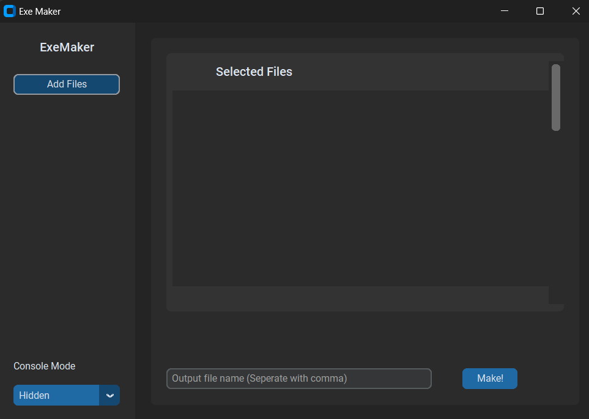
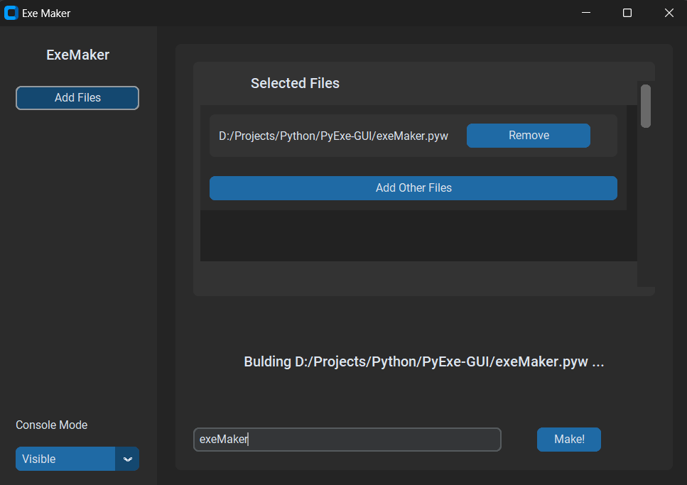

# PyExe-GUI

PyExe-GUI is a comprehensive and user-friendly tool designed to simplify the process of converting Python files (.py) into executable files (.exe). With PyExe-GUI, you can seamlessly transform your Python projects into standalone executables, making it effortless to distribute and run your applications on various systems.
### Screenshots
Empty

In Action

## Features

- **Graphical User Interface (GUI):** PyExe-GUI provides an intuitive and interactive GUI that guides users through the process of converting Python files to executables. The user-friendly interface eliminates the need for complex command-line interactions, making it accessible to users of all skill levels.

- **Efficient Conversion:** PyExe-GUI utilizes powerful conversion techniques to ensure efficient and accurate transformation of Python files into executable format. The tool handles dependencies, bundles resources, and optimizes the resulting executable for optimal performance.

- **Cross-Platform Compatibility:** The executables generated by PyExe-GUI are designed to be compatible with multiple operating systems, including Windows, macOS, and Linux. This enables seamless deployment of your Python applications across different platforms.

- **Customization Options:** PyExe-GUI offers a range of customization options to tailor the executable output according to your requirements. You can specify application icons, include additional files or resources, and configure various runtime settings to optimize the behavior of your executable.

## Developer Tools

To develop PyExe-GUI, we utilized the following tools:

- [Python 3.8.5](https://www.python.org/ftp/python/3.8.5/Python-3.8.5.tar.xz)

  

- [Visual Studio Code](https://code.visualstudio.com)

  

- [Git](https://git-scm.com/)

  

## Developers

PyExe-GUI is the result of collaborative efforts. The following developers have contributed to the project:

- [Shivang Yadav](https://github.com/shivang1809)
- [Apoorv Mittal](https://github.com/Apoorv012)
- [Sujal Choudhari](https://github.com/SujalChoudhari)

## Usage

1. Download the PyExe-GUI package from [GitHub](https://github.com/pyexe-gui/pyexe-gui).

2. Install Python 3.8.5 or a compatible version on your system.

3. Open the PyExe-GUI tool using your preferred Python development environment, such as Visual Studio Code.

4. Select the Python file (.py) that you want to convert to an executable using the file browser within the PyExe-GUI.

5. Configure any desired customization options, such as specifying an application icon or including additional files.

6. Click the "Convert" button to initiate the conversion process.

7. PyExe-GUI will generate the executable file (.exe) in the specified output directory.

8. Distribute the generated executable to users, who can then run your Python application without requiring Python or any dependencies.

## License

PyExe-GUI is licensed under the MIT license. See the [LICENSE](LICENSE) file for details.
